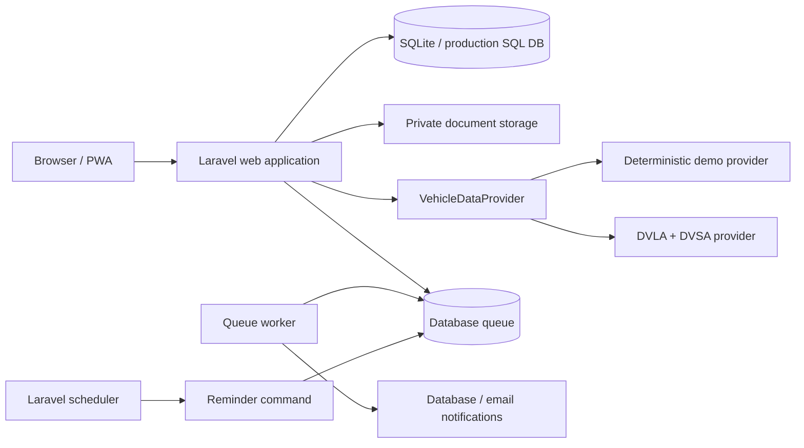

# That Car App

[](https://github.com/Adel-Mtr/that-car-app/actions/workflows/ci.yml)


**A vehicle-ownership companion that turns maintenance, MOT history, legal dates, documents and community activity into one useful garage.**

That Car App is a server-rendered Laravel application designed around the day-to-day reality of owning a car. It combines vehicle health planning, maintenance history, reminders, private documents, shared garages, public vehicle passports, events, specialist discovery and booking in one product.

The application works out of the box with deterministic demo vehicle data. It also contains a production-oriented provider for UK DVLA Vehicle Enquiry and DVSA MOT-history integrations when credentials are supplied.

> This is an independent portfolio project. It is not affiliated with or endorsed by DVLA, DVSA or any vehicle manufacturer.

## 60-second technical tour

1. **Trace vehicle creation:** [`CreateVehicle`](app/Actions/Vehicles/CreateVehicle.php) coordinates vehicle data, MOT records, reminders and health scoring inside a database transaction.
2. **Inspect access control:** [`VehiclePolicy`](app/Policies/VehiclePolicy.php) and [related policies](app/Policies) enforce owner/manager/viewer permissions at the resource boundary.
3. **Check privacy:** [`VehicleDocumentController`](app/Http/Controllers/VehicleDocumentController.php) authorises downloads; [`PublicGarageController`](app/Http/Controllers/PublicGarageController.php) exposes a curated public view.
4. **Review test evidence:** [feature tests](tests/Feature) cover user-facing workflows and cross-user isolation; [unit tests](tests/Unit) cover health scoring and vehicle-provider behaviour.

### Engineering decisions

- **Server-rendered monolith:** Blade and Laravel fit relational, form-driven workflows without a separate SPA/API deployment.
- **Replaceable vehicle provider:** a contract separates deterministic demo data from credential-backed government integrations.
- **Explainable health scoring:** rules return reasons alongside a score; this is a demo prioritisation aid, not a vehicle safety assessment.
- **Queued reminders:** background notifications and scheduling run separately from web requests.
- **Reproducible local evaluation:** committed lockfiles, seed data and container smoke checks make setup failures visible in CI.

The documented demo runs locally. No hosted demo is linked yet; public production deployment requires separate security and operational configuration.

## Product highlights

- **Vehicle garage** — add vehicles by registration and maintain mileage, insurance and visibility settings.
- **Vehicle health score** — prioritises expired/approaching MOT, tax, insurance, overdue work and unresolved MOT defects.
- **MOT history** — stores test history and turns advisories into actionable maintenance records.
- **Maintenance timeline** — planned and completed work, mileage, provider and precise cost history.
- **Smart reminders** — lead-time notifications with monthly, quarterly and yearly recurrence.
- **Private document vault** — invoices, MOT files, insurance and receipts stored outside the public web root.
- **Shared garages** — owners can grant viewer or manager access with policy-backed permissions.
- **Public vehicle passport** — share selected vehicle history without exposing registration numbers or private files.
- **Events** — discover meets, shows, drives and track events and register attendance with a managed vehicle.
- **Specialists and bookings** — browse automotive specialists and request work for vehicles you manage.
- **Community feed** — publish vehicle updates and build/drive posts.
- **Notifications** — queued database/email reminders and vehicle-sharing notifications.
- **Admin operations** — role-gated management for booking status/quotes, events and specialist listings.
- **PWA shell** — installable manifest, application icons and offline navigation fallback.

## Quick start with Docker

The Docker setup is the easiest way to run the complete application. It starts the web application, database-backed queue worker and Laravel scheduler, creates the SQLite database, runs migrations and seeds demo content automatically.

### Requirements

- Docker Engine / Docker Desktop
- Docker Compose v2

```bash
git clone --depth 1 https://github.com/Adel-Mtr/that-car-app.git
cd that-car-app
docker compose up --build
```

Open **http://localhost:8000**.

### Demo account

```text
Email:    demo@thatcarapp.test
Password: password
```

Admin demo:

```text
Email:    admin@thatcarapp.test
Password: password
```

These credentials only belong to seeded local demo data and must not be reused in a real deployment.

If you register a new account in the Docker demo, email is intentionally sent to Laravel's log mailer. The queued verification message (including its local verification link) can be inspected with:

```bash
docker compose logs -f queue
```

Stop the application with:

```bash
docker compose down
```

Reset the demo database and uploaded demo files:

```bash
docker compose down -v
docker compose up --build
```

## Local development

### Requirements

- PHP 8.4.1+ (required by the committed dependency lockfile)
- Composer 2
- Node.js 22+
- SQLite with the PHP PDO SQLite extension
- PHP extensions required by Laravel/PHPUnit, including `mbstring`, `dom`, `xml` and `xmlwriter`

### Setup

```bash
composer install
cp .env.example .env
php artisan key:generate
touch database/database.sqlite
php artisan migrate --seed
npm ci
npm run build
```

Start the Laravel development environment:

```bash
composer dev
```

Or use the Makefile:

```bash
make setup
make demo
make dev
```

## Vehicle data providers

### Demo provider — default

No external credentials are required. `DemoVehicleDataProvider` derives stable sample vehicle/MOT data from the registration, making the app straightforward to evaluate, test and develop offline after dependencies are installed.

```env
VEHICLE_DATA_DRIVER=demo
```

### UK government provider

Set the driver to `government` and supply your own credentials:

```env
VEHICLE_DATA_DRIVER=government
DVLA_VES_API_KEY=
DVLA_VES_URL=https://driver-vehicle-licensing.api.gov.uk/vehicle-enquiry/v1/vehicles
DVSA_MOT_API_KEY=
DVSA_MOT_CLIENT_ID=
DVSA_MOT_CLIENT_SECRET=
DVSA_MOT_TOKEN_URL=
DVSA_MOT_SCOPE=https://tapi.dvsa.gov.uk/.default
```

The provider combines vehicle data with MOT history, normalises upstream responses, caches the DVSA access token and converts upstream failures into safe user-facing errors.

## Architecture



The project uses Laravel policies and form requests at the HTTP boundary, action/service classes for domain workflows, Eloquent models for persistence, Blade/Tailwind for the UI and queued notifications for background work.

See [architecture notes](docs/architecture.md) for a deeper walkthrough.

## Testing and quality gates

The project includes feature and unit coverage for:

- registration, login, logout, verification and password reset;
- vehicle creation and cross-user data isolation;
- owner/manager/viewer permissions;
- maintenance completion and health recalculation;
- reminder notification windows and recurring reminders;
- private document storage and authorisation;
- public-passport privacy boundaries;
- events and vehicle attendance permissions;
- specialist booking lifecycle;
- admin event/specialist CRUD and booking operations;
- community posting permissions;
- government vehicle-data normalisation and failure handling;
- admin-only access.

Run locally:

```bash
php artisan test --compact
vendor/bin/pint --test
npm run build
```

GitHub Actions runs PHP tests/style checks, the Vite production build, and a Docker image build on pushes and pull requests.

## Privacy and security choices

- `.env` files, SQLite databases, sessions, caches and uploaded documents are ignored by Git.
- Uploaded vehicle documents use Laravel's private local disk rather than `public/`.
- Public vehicle passports intentionally exclude the full registration and private document metadata.
- Vehicle operations are protected by Laravel policies with owner, manager and viewer roles.
- Login attempts are rate limited.
- Live vehicle-service credentials are environment-only.
- Queued work and scheduled reminders run separately from the request lifecycle.

## Production deployment

The included Docker image installs development dependencies because the local demo seeder uses Faker-backed factories. It is a reviewer/demo image, not a hardened production image. For production, use a separate `--no-dev` build, disable demo seeding and provision real accounts securely.

The included Docker Compose file is optimised for a local/demo install. For a public production deployment, use a persistent production database (for example PostgreSQL/MySQL), durable private file/object storage, a unique `APP_KEY`, a real mail transport, HTTPS, a queue worker and a scheduler process.

See [deployment notes](docs/deployment.md).

## Repository structure

```text
app/
  Actions/          Domain workflows
  Contracts/        Vehicle-data abstraction
  Http/             Controllers + validated requests
  Models/           Eloquent domain models
  Notifications/    Queued notifications
  Policies/         Authorisation rules
  Services/         Vehicle data + health logic
database/
  factories/
  migrations/
  seeders/
resources/
  css/
  js/
  views/
public/              PWA assets + web entrypoint
tests/
  Feature/
  Unit/
docker/              Container entrypoint
docs/                Architecture + deployment notes
```

## License

MIT — see [LICENSE](LICENSE).
