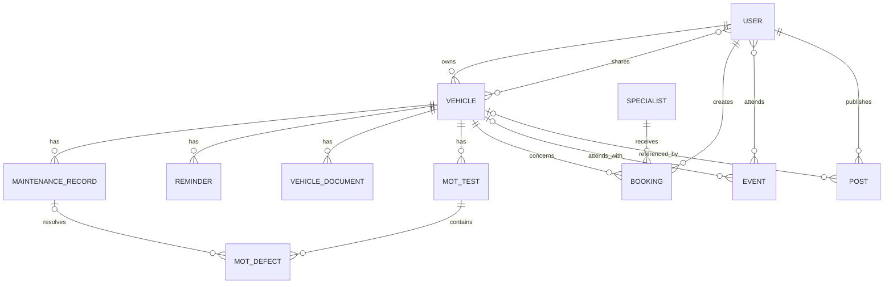

# Architecture

That Car App is a Laravel monolith by design: the product is primarily relational, form-driven and server-rendered, so a separate SPA/API layer would add operational complexity without improving the core ownership workflows.

## Request boundary

Routes are split between public marketing/public-passport pages, guest authentication routes and verified member routes. Mutating requests are validated through dedicated `FormRequest` classes where appropriate, while Laravel policies enforce object-level permissions.

The main access model is:

- **Owner** — full control over a vehicle and its shared access.
- **Manager** — can update shared vehicle data, maintenance, reminders, documents and related actions.
- **Viewer** — read-only access to an accepted shared vehicle.
- **Admin** — application-level gate override for the operational dashboard.

Reusable `accessibleVehiclesQuery()` and `manageableVehiclesQuery()` queries keep those role semantics consistent across dashboard, event, booking and community surfaces.

## Domain workflows

### Vehicle creation

`CreateVehicle` coordinates the initial ownership workflow:

1. normalise the registration;
2. request vehicle/MOT information through the `VehicleDataProvider` contract;
3. create the vehicle inside a database transaction;
4. persist MOT tests and defects;
5. convert MOT defects into actionable maintenance records;
6. generate legal-date reminders;
7. calculate the initial vehicle-health score.

The provider contract supports two implementations:

- `DemoVehicleDataProvider` for deterministic zero-credential development/demo use;
- `GovernmentVehicleDataProvider` for DVLA Vehicle Enquiry + DVSA MOT data.

### Vehicle health

`VehicleHealthService` is a deterministic rules engine. It begins from 100 and applies bounded penalties for:

- expired or approaching MOT;
- untaxed/expiring vehicle tax;
- expired insurance date;
- overdue planned maintenance;
- unresolved dangerous, major or advisory MOT defects.

The calculation produces both a numeric score and explainable reasons so the UI can show *why* a vehicle needs attention rather than displaying an opaque metric.

### Reminders

Reminders support lead windows and optional monthly, quarterly or yearly recurrence. The scheduled `reminders:send-due` command finds reminders entering their notification window and dispatches queued notifications only once per occurrence. Completing a recurring reminder creates its next occurrence while preserving the completed reminder as history.

### Documents

Vehicle files are stored on Laravel's private filesystem disk. Access is always routed through an authorised controller action, not a public storage URL. Public vehicle passports deliberately query curated maintenance/posts only and never expose uploaded file names or private registration data.

## Background processing

Notifications implement `ShouldQueue`. The default local Docker stack therefore includes:

- a web process;
- a database queue worker;
- a scheduler process.

For production, the queue/cache/session backends can be changed through Laravel configuration without changing domain code.

## Data model

Core relationships:

## Frontend

The UI uses Blade and Tailwind CSS 4 with a deliberately small JavaScript layer for sidebar/dialog/tabs/copy interactions and service-worker registration. This keeps the application progressively usable without a large client-side state framework.

The PWA service worker uses a network-first strategy for page navigation with an offline fallback, while static style/script/font/image assets are cached opportunistically.

## Reliability considerations

- Vehicle creation is transactional so partial MOT/reminder imports cannot leave half-created garages.
- External API calls use explicit timeouts and bounded retries.
- DVSA OAuth tokens are cached.
- Missing live credentials fail with a clear domain exception instead of a low-level HTTP error.
- Optional MOT test numbers remain nullable to avoid false uniqueness collisions.
- Queue work is retried separately from web requests.
- The Docker demo persists its SQLite database and private documents in named volumes.
